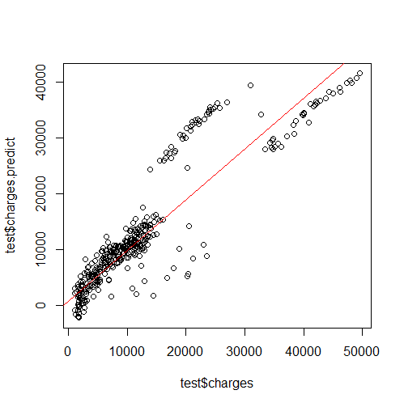

# Regression - Medical Insurance Cost Prediction

## Objective : 
Medical expense is a crucial topic for every US citizen as medical cost in the US is relatively high in the world. Medical needs are unaffordable to most of the population without medical insurance. Therefore medical insurance industry is a critical product for insurance companies. The aim of this study is to analyze and predict the medical insurance premium (charges) for individuals.  

This project is written in ***R***.  
For quick summary, please refer to our [powerpoint](https://drive.google.com/file/d/1NjQW8-6npV46wZWZ2HJn95Wjg5RiJ6wQ/view?usp=sharing).

## Dataset :
This dataset is provided in the book "Machine Learning with R" which can be found on [Github](https://github.com/stedy/Machine-Learning-with-R-datasets) or [Kaggle](https://www.kaggle.com/mirichoi0218/insurance). The data contains medical information and costs billed by health insurance companies. It contains 1338 rows of data and the following columns:

- age: age of primary beneficiary
- sex: insurance contractor gender, female, male
- bmi: Body mass index, providing an understanding of body, weights that are relatively high or low relative to height, objective index of body weight (kg / m ^ 2) using the ratio of height to weight, ideally 18.5 to 24.9
- children: Number of children covered by health insurance / Number of dependents
- smoker: Smoking
- region: the beneficiary's residential area in the US, northeast, southeast, southwest, northwest.
- charges: Individual medical costs billed by health insurance

## Highlights from Exploratory Data Analysis :

### Correlation between numerical variables
The darker the color, the stronger the correlation. The pie charts shows the proportion of the correlation between variables.
Relatively speaking, charges have a stronger correlation to age. The independent variables have weak correlation with each other.  

### Age and Charges
    
Charges is directly proportional with age. The average charges rise when age increases.
If we take smoker factor into account, which is displayed in 2 different colours
Most smokers are charged more than non-smokers.

### BMI, Smoker and Charges
   
The distribution of BMI and charges looks like a megaphone , i.e. the charges becomes more diversified when BMI increases.
Non-smokers(blue colour) have a more concentrated distribution below $20000. Charges for smokers(pink colour) increase with their BMI.

## Data Cleaning : 
1. Convert the categorical variables (Sex, Smoker, Region) into factors
2. Remove outliers in the BMI variable identified in the boxplot
3. Remove influential outliers using Cook’s distance

## Results : 
### Interpretation of the coefficients 
  
- Age : when age increases by 1 unit, i.e. 1 year older, the insurance premium increase by $252.35, holding other variables constant
- Bmi : when bmi increases by 1 unit, the insurance premium increase by $294.96, holding other variables constant
- Children : when children increases by 1 unit, i.e. one more child, the insurance premium increase by $493.92, holding other variables constant
- Smoker : a smoker pays $24747.34 more than a non-smoker, holding other variables constant
- Region : 
  1) Northwest : Clients in Northwest pay $1003.73 less than Northeastern clients, holding other variables constant
  2) Southeast : Clients in Southeast pay $1125.22 less than Northeastern clients, holding other variables constant
  3) Southwest : Clients in Southeast pay $1094.49 less than Northeastern clients, holding other variables constant

### In-sample Analysis
  
The model predicts most of the test data but not when the charges rise. There seems to be three groups of medical insurance charges. We may work further on it in the future.

## Acknowledgements :
[Lantz, B. (2013). Machine Learning with R, Packt Publishing.](https://www.amazon.com/Machine-Learning-R-Brett-Lantz/dp/1782162143)
	
